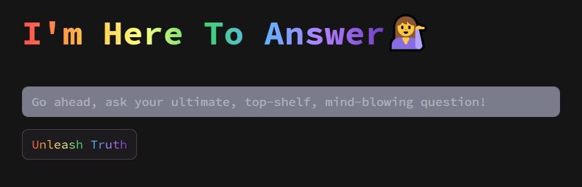
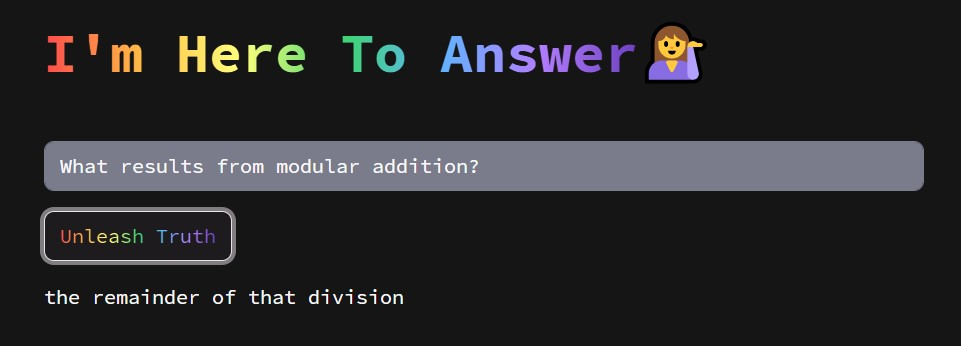

# Retrieval Based Question Answering System

## A project with a Streamlit interface that returns the most accurate predefined answer to a given question.

- The project is based on a dataset containing around 90,000 question-answer pairs.
- It uses the Hugging Face sentence transformer model `all-MiniLM-L6-v2` for embedding the sentences.
- This model is chosen because it is small, fast, and effective at generating sentence embeddings.
- The user interface is built with Streamlit.  When a user asks a question through the Streamlit app, the question is embedded using the same model.
- FAISS is used to find the most similar question from the dataset.
- The matched answer is then shown to the user.
- The project also includes an evaluation script to test the model’s performance.
  

#### Here is the design of the application!

#### After a search

#### You can customize the theme settings in the `.streamlit/config.toml`

#### How to Run the Project
- First, install the required libraries with the following command:  `pip install -r requirements.txt`
- The main file to run the app is `main.py`.
- The sentence embeddings are already provided in a `.zip` file.
- These embeddings will be extracted and used in `.pkl` format during the run.
- To start the app, just run this command in your terminal: `streamlit run main.py`
- If you want to try different sentence transformer models or change the current one, you can use the `Hugging_Face.ipynb` file for testing.

Note: I worked on the Hugging_Face.ipynb file in Google Colab. While uploading it to GitHub, I had to clear the cell outputs due to some errors. 
Therefore, the outputs related to the datasets I used are not visible in the notebook.

